  

  <a href="#about-me"><kbd>About Me</kbd></a>&nbsp;&nbsp;
  <a href="#experience"><kbd>Experience</kbd></a>&nbsp;&nbsp;
  <a href="#featured-projects"><kbd>Featured Projects</kbd></a>&nbsp;&nbsp;
  <a href="#education"><kbd>Education</kbd></a>&nbsp;&nbsp;
  <a href="#technical-skills"><kbd>Technical Skills</kbd></a>

  
  
  

## 01 — About Me

<table>
<tr>
<td width="66%" valign="top">

### Professional Profile

I am an **AI Engineer and M.S. Artificial Intelligence student at Northeastern University** focused on Generative AI, agentic systems, retrieval, and LLM evaluation. I build beyond proof-of-concept demos—designing the ingestion, retrieval, orchestration, verification, caching, and deployment layers required to make AI systems dependable in real use.

My experience spans healthcare RAG, financial intelligence agents, recommendation systems, computer vision, OCR, and optimized model inference. Across these domains, my goal remains the same: create AI products that are **grounded, measurable, observable, and production-ready**.

</td>
<td width="34%" valign="top">

### Career Focus

**Primary area**  
Generative AI and agents

**Specialization**  
RAG, retrieval, LLM evaluation and optimization

**Seeking**  
Spring 2027 co-op from January 2027, AI/ML internships, and full-time AI roles

**Location**  
Boston, Massachusetts

</td>
</tr>
</table>

> **Engineering philosophy:** A useful AI system does more than generate an answer—it retrieves the right evidence, reasons within constraints, verifies its output, and exposes enough signal to improve safely.

## 02 — Experience

### AI Engineer Intern — Kideon

`U.S.-based company` · `Remote from India` · `December 2024 – August 2025`

- Designed and built a **production-grade Retrieval-Augmented Generation pipeline** for Kideon's gym and healthcare platform during its pre-launch phase, supporting health records, smartwatch data, and laboratory or blood-test reports.
- Implemented an **LLM-based triage layer** that classified incoming records for clinical relevance and data quality, filtering noise and flagging incomplete or malformed uploads before ingestion.
- Built a **persistent patient-memory system** using vector retrieval and structured metadata, allowing downstream recommendations to use a longitudinal record history instead of treating every upload independently.
- Developed a personalized plan-generation module that combined retrieved patient context with LLM reasoning to produce workout and nutrition plans, with recommendations traceable to the dates, metrics, and test values that supported them.
- Designed a **verification and safety layer** where an LLM-as-judge checked each plan against the retrieved patient history, scored consistency, and routed low-confidence or contradictory results to human review.
- Built the system as containerized **FastAPI microservices** with Docker and Redis-backed retrieval caching; the broader team later deployed the platform on AWS for concurrent post-launch use.

`Generative AI` `RAG` `LLM Evaluation` `FastAPI` `Redis` `Docker` `AWS`

---

### Video Analytics Intern — Jio Platforms

`Hyderabad, India` · `Hybrid` · `November 2023 – May 2024`

- Developed a real-time **vehicle and license-plate recognition system** using YOLOv7 and PaddleOCR, achieving **more than 92% detection and recognition accuracy** across varied lighting and camera conditions.
- Integrated the optimized models with **ONNX Runtime**, reducing inference latency by **35%** and enabling processing across live CCTV streams and prototype smart-camera systems.
- Built a Python-based image scraper and annotation workflow that produced **20,000+ curated training samples**, strengthening performance on edge cases including motion blur, partial occlusion, and difficult viewing angles.
- Collaborated with a small team to train and fine-tune **Stable Diffusion models for synthetic image generation and training-data augmentation** using human-image datasets.
- Supported an internal prototype intended to evolve into a future customer product: it began with baby-smile recognition and later expanded to cry, posture, and movement-related monitoring.
- Contributed to the integration and internal evaluation pipeline while deployment of the complete prototype was handled collaboratively by the wider team.

`Computer Vision` `YOLOv7` `PaddleOCR` `OpenCV` `ONNX Runtime` `Stable Diffusion`

## 03 — Featured Projects

Each project stays compact while browsing. Select one to open the complete engineering brief.

<table>
<tr>
<td width="100%">

<b>Agentic RAG for Pharmaceutical Safety</b> — Production-oriented retrieval over approximately 15,000 versioned FDA drug labels

 

#### Overview

Independently designed and implemented an end-to-end agentic RAG system for pharmaceutical safety documentation. The corpus uses the current PDF version of each FDA drug label alongside historical DailyMed Structured Product Labeling XML, preserving both real document layouts and authentic version changes.

#### Engineering details

- Used **Docling** for layout-aware parsing of current-label PDFs so dosing tables, adverse-reaction tables, and interaction sections retained meaningful structure.
- Added **pdfplumber as a targeted fallback** for tables that could not be resolved cleanly by the primary parser.
- Parsed historical SPL XML with **lxml and XPath against LOINC section codes**, turning section extraction into a deterministic lookup instead of fragile pattern matching.
- Implemented hybrid retrieval with **Qdrant dense search and BM25**, merged candidates through Reciprocal Rank Fusion, and applied cross-encoder reranking before generation.
- Used **LangGraph** to control model routing, retrieval decisions, verification, guardrails, and bounded corrective paths.
- Added PostgreSQL metadata, Redis caching, evaluation-gated releases, observability, FastAPI services, and Dockerized deployment components.

#### Why it matters

The project models a recognizable enterprise use case: grounded question answering and historical change analysis over regulated pharmaceutical safety documentation.

`Python` `Docling` `lxml` `Qdrant` `BM25` `LangGraph` `PostgreSQL` `Redis` `FastAPI` `Docker`

<!-- TODO: Add repository URL and final evaluation metrics. -->

<b>Agentic Game Recommendation System</b> — Personalized discovery using hybrid retrieval, learned ranking, and Steam context

 

#### Overview

Independently built a recommendation platform that interprets nuanced player intent and produces personalized game suggestions instead of relying only on genre or popularity filters.

#### Engineering details

- Combined **ChromaDB dense retrieval, BM25, Reciprocal Rank Fusion, and selective HyDE** for queries where hypothetical-document expansion improved recall.
- Used LLM-assisted tag enrichment and self-distillation to create relevance pairs, including difficult hard negatives for training.
- Fine-tuned a **bi-encoder retrieval model and QLoRA reranker** to improve ranking quality beyond the initial general-purpose embeddings.
- Orchestrated query parsing, retrieval, reranking, personalization, and explanation generation using **LangGraph**.
- Integrated Steam-library context so recommendations could account for games a user already owned or played.
- Added two-level Redis caching, FastAPI endpoints, Dockerized local deployment, Ollama support, and ONNX-optimized inference.

#### Why it matters

The system demonstrates the full recommendation lifecycle: data enrichment, retrieval, learned ranking, agent control, personalization, optimization, and serving.

`Python` `LangGraph` `ChromaDB` `BM25` `HyDE` `QLoRA` `Redis` `FastAPI` `Ollama` `ONNX`

<!-- TODO: Add repository URL and final ranking and latency metrics. -->

<b>VOID AI — Analyst Coverage Gap Intelligence</b> — Multi-agent research across more than 1,700 U.S. equities

 

#### [View repository ↗](https://github.com/aatmaj28/Void-AI)

#### Overview

Co-developed an AI investment-intelligence platform that identifies companies with high market activity but limited analyst coverage. The application combines SEC-filings retrieval, quantitative scoring, historical validation, and a five-agent CrewAI debate workflow.

#### My contributions

- Designed and implemented the **historical backtesting engine** used to validate opportunity signals against subsequent market behavior.
- Built the stock-comparison workflow and major portfolio-tracking interfaces used to investigate and retain opportunities.
- Implemented authentication integration, historical-score APIs, database migrations, and fixes for incomplete or inconsistent real-market data.
- Contributed across the Next.js frontend, FastAPI services, Supabase database, and pgvector-backed retrieval layer.

#### Platform architecture

- Scans **1,700+ U.S. equities** using market, company, analyst-coverage, and SEC filing data.
- Uses a five-agent CrewAI debate process to challenge and consolidate research signals.
- Includes SEC-filings RAG, daily opportunity scoring, portfolio tracking, stock comparison, and signal validation.

`Next.js` `TypeScript` `FastAPI` `CrewAI` `Haystack` `Supabase` `pgvector` `XGBoost`

<b>Equity Performance Screener</b> — Time-aware machine learning for next-quarter S&amp;P 500 outperformance

 

#### [View repository ↗](https://github.com/Vijwalmahen/equity-screener)

#### Overview

Independently built an end-to-end ML system that ranks S&amp;P 500 companies by the probability of outperforming in the following quarter using time-ordered fundamental and market data.

#### Engineering details

- Benchmarked six machine-learning classifiers against four simple financial baselines.
- Preserved chronology throughout training and evaluation to prevent future information from leaking into earlier predictions.
- Achieved a **0.577 held-out ROC-AUC** with XGBoost and a **0.566 average expanding-window AUC across 16 quarters**.
- Added SHAP explanations, automated leakage tests, conformal prediction, transaction-cost analysis, and uncertainty-aware outputs.
- Served predictions through FastAPI and built a React interface for ranking, filtering, and inspecting individual companies.

`Python` `XGBoost` `scikit-learn` `SHAP` `FastAPI` `React`

<b>ResilienceAI</b> — Eight-agent exploration of cascading global supply-chain risk

 

#### [View repository ↗](https://github.com/Chandi713/Hackathon---End-Of-The-World)

#### Overview

A hackathon-built platform that coordinates eight specialist agents to explore how disruptions can cascade across countries and risk domains using **25 years of data covering 266 countries**.

#### My contributions

- Built the country-selection experience used to configure and explore geographic risk scenarios.
- Integrated frontend components with the backend APIs, resolving data-flow and full-stack interaction issues.
- Contributed to the interactive exploration workflow while collaborating within the broader hackathon team.

`LangGraph` `Python` `FastAPI` `Next.js` `TypeScript` `Recharts`

</td>
</tr>
</table>

## 04 — Education

<table>
<tr>
<td width="52%" valign="top">

### Northeastern University

**Master of Science in Artificial Intelligence**  
Boston, Massachusetts  
September 2025 – Expected 2027

**GPA: 3.84/4.00**

</td>
<td width="48%" valign="top">

### Vellore Institute of Technology

**B.Tech in Computer Science and Engineering**  
Specialization in Internet of Things  
2021 – 2025

**CGPA: 8.78/10**  
Major project: LLM quantization and model-size reduction  
Community: VIT Gamers Club

</td>
</tr>
</table>

## 05 — Technical Skills

### Core Engineering Stack

  
  
  
  
  
  
  
  

<table>
<tr>
<td width="50%" valign="top">

### Generative AI & Agents

- Large Language Models and Generative AI
- Agentic systems and multi-agent workflows
- Retrieval-Augmented Generation
- LangChain and LangGraph
- Hugging Face ecosystem
- Model routing, memory, tool use, and guardrails
- LLM-as-judge evaluation and human review
- Retrieval, grounding, latency, and cost evaluation

### Languages

- Python, C++, SQL
- JavaScript, Java
- HTML and CSS

### Data & Retrieval

- PostgreSQL, Supabase, pgvector
- Qdrant and ChromaDB
- Redis caching
- BM25, dense retrieval, hybrid search, RRF

</td>
<td width="50%" valign="top">

### Machine Learning & NLP

- PyTorch, TensorFlow, and Keras
- scikit-learn and XGBoost
- Pandas and NumPy
- NLP, ranking, classification, and recommendation
- Reinforcement learning
- Quantization, pruning, and model optimization

### Computer Vision

- OpenCV, YOLOv7, and PaddleOCR
- Stable Diffusion fine-tuning and data generation
- ONNX Runtime optimization
- Real-time video analytics and OCR

### Backend, Cloud & Development

- FastAPI and REST API design
- Docker and AWS
- Git, Linux, VS Code, and Jupyter
- Containerized microservices
- Caching, observability, and deployment pipelines

</td>
</tr>
</table>

## 06 — Currently Exploring

- Reliable multi-agent systems with routing, memory, guardrails, and human-in-the-loop workflows
- RAG evaluation across retrieval quality, grounding, latency, and cost
- Efficient LLM deployment through quantization, pruning, and inference optimization

---

  
  

<code>Building AI systems that earn trust in production.</code>

