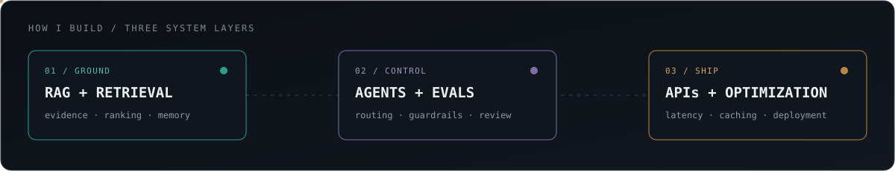
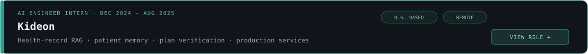
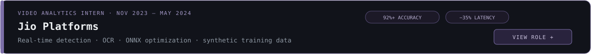
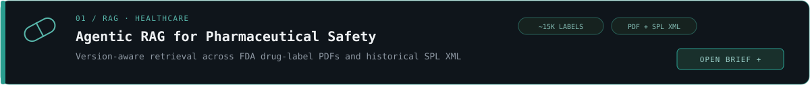
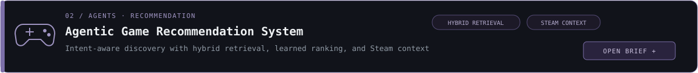
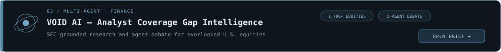
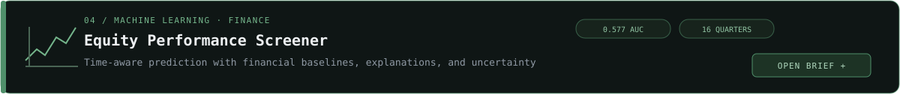
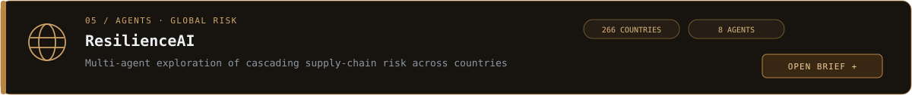
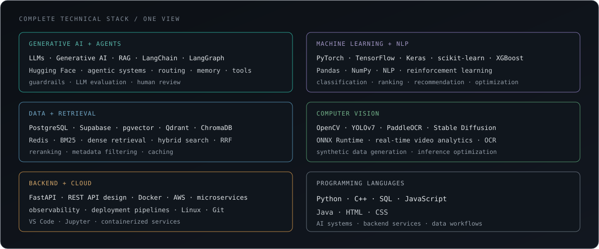

  

  
  
  
  
  

  
  
  

## About Me

I build the engineering layers that turn capable models into **reliable AI products**. My focus is Generative AI, agentic workflows, retrieval, and LLM evaluation—supported by hands-on work in healthcare, finance, recommendation systems, computer vision, and optimized inference.

  
  
  
  

  

> **Open to:** Spring 2027 co-ops beginning January 2027, AI/ML internships, and full-time AI engineering roles.

## Experience

Select a role to view the complete engineering work.

 

- Designed and built a **production-grade RAG pipeline** for Kideon's gym and healthcare platform during its pre-launch phase, supporting health records, smartwatch data, and laboratory or blood-test reports.
- Implemented an **LLM-based triage layer** that classified incoming records for clinical relevance and quality, filtering noise and flagging incomplete or malformed uploads before ingestion.
- Built a **persistent patient-memory system** using vector retrieval and structured metadata, giving downstream recommendations access to longitudinal history instead of a single upload.
- Developed personalized workout and nutrition plan generation grounded in retrieved patient context, with recommendations traceable to the dates, metrics, and test values supporting them.
- Designed a verification layer where an **LLM-as-judge** rechecked plans against the patient history and routed low-confidence, unsafe, or contradictory results to human review.
- Built containerized FastAPI microservices with Docker and Redis-backed retrieval caching; the wider team later deployed the platform on AWS.

`Generative AI` `RAG` `LLM Evaluation` `FastAPI` `Redis` `Docker` `AWS`

 

- Developed a real-time **vehicle and license-plate recognition system** with YOLOv7 and PaddleOCR, achieving **more than 92% accuracy** across varied lighting and camera conditions.
- Integrated optimized models with **ONNX Runtime**, reducing inference latency by **35%** for live CCTV streams and prototype smart-camera systems.
- Built a Python image-scraping and annotation workflow that produced **20,000+ curated samples**, improving robustness to motion blur, occlusion, and difficult viewing angles.
- Collaborated with a small team to train and fine-tune **Stable Diffusion models for synthetic training-image generation and augmentation**.
- Supported an internal prototype intended to evolve into a future customer product, beginning with baby-smile recognition and later expanding to cry, posture, and movement monitoring.
- Contributed to integration and internal evaluation while deployment of the complete prototype was handled collaboratively by the wider team.

`Computer Vision` `YOLOv7` `PaddleOCR` `OpenCV` `ONNX Runtime` `Stable Diffusion`

## Featured Projects

Each card is interactive. Select one to open its complete project brief.

 

### Agentic RAG for Pharmaceutical Safety

Independently designed and implemented an end-to-end agentic RAG system over approximately **15,000 FDA drug labels**. It uses current-label PDFs alongside historical DailyMed Structured Product Labeling XML, preserving both authentic document structure and version history.

**Architecture and engineering**

- Parsed current PDFs with **Docling** for layout awareness and used pdfplumber as a targeted fallback for unresolved dosing, adverse-reaction, and interaction tables.
- Extracted historical XML sections deterministically with **lxml and XPath against SPL LOINC codes**.
- Combined Qdrant dense retrieval with BM25, merged candidates using Reciprocal Rank Fusion, and applied cross-encoder reranking before generation.
- Used LangGraph for model routing, retrieval decisions, controlled correction paths, guardrails, and verification.
- Added PostgreSQL metadata, Redis caching, observability, evaluation-gated releases, FastAPI services, and Dockerized components.

**Why it matters:** This models a recognizable enterprise use case—grounded retrieval and historical safety analysis over regulated pharmaceutical documentation.

`Python` `Docling` `lxml` `Qdrant` `BM25` `LangGraph` `PostgreSQL` `Redis` `FastAPI` `Docker`

<!-- TODO: Add repository URL and final evaluation metrics. -->

 

### Agentic Game Recommendation System

Independently built a recommendation platform that interprets nuanced player intent and generates personalized suggestions instead of relying only on genre and popularity filters.

**Architecture and engineering**

- Combined ChromaDB dense retrieval, BM25, Reciprocal Rank Fusion, and selective HyDE to improve recall for complex queries.
- Used LLM-assisted tag enrichment and self-distillation to create training pairs with challenging hard negatives.
- Fine-tuned a **bi-encoder retrieval model and QLoRA reranker** to improve ranking beyond general-purpose embeddings.
- Used LangGraph to coordinate intent parsing, retrieval, reranking, personalization, and explanation generation.
- Integrated Steam-library context to account for games a player already owned or played.
- Added two-level Redis caching, FastAPI endpoints, Dockerized local deployment, Ollama support, and ONNX-optimized inference.

**Why it matters:** The system covers the full recommendation lifecycle—enrichment, retrieval, learned ranking, agent control, personalization, optimization, and serving.

`Python` `LangGraph` `ChromaDB` `BM25` `HyDE` `QLoRA` `Redis` `FastAPI` `Ollama` `ONNX`

<!-- TODO: Add repository URL and final ranking and latency metrics. -->

 

### [VOID AI — Analyst Coverage Gap Intelligence ↗](https://github.com/aatmaj28/Void-AI)

Co-developed an AI investment-intelligence platform that identifies companies with high market activity but limited analyst coverage. It combines SEC-filings retrieval, quantitative scoring, historical validation, and a five-agent CrewAI debate workflow.

**My contributions**

- Designed and implemented the historical backtesting engine used to validate opportunity signals against later market behavior.
- Built the stock-comparison workflow and major portfolio-tracking interfaces.
- Implemented authentication integration, historical-score APIs, database migrations, and corrections for incomplete or inconsistent market data.
- Contributed across the Next.js frontend, FastAPI services, Supabase database, and pgvector-backed retrieval layer.

**Platform:** Scans **1,700+ U.S. equities** and combines SEC-filings RAG, a five-agent debate process, daily opportunity scoring, portfolio tracking, stock comparison, and signal validation.

`Next.js` `TypeScript` `FastAPI` `CrewAI` `Haystack` `Supabase` `pgvector` `XGBoost`

 

### [Equity Performance Screener ↗](https://github.com/Vijwalmahen/equity-screener)

Independently built an end-to-end ML system that ranks S&amp;P 500 companies by the probability of outperforming during the following quarter using time-ordered fundamental and market data.

**Architecture and results**

- Benchmarked six machine-learning classifiers against four simple financial baselines.
- Preserved chronology through training and evaluation to prevent future information leaking into earlier predictions.
- XGBoost achieved a **0.577 held-out ROC-AUC** and a **0.566 average expanding-window AUC across 16 quarters**.
- Added SHAP explanations, automated leakage tests, conformal prediction, transaction-cost analysis, and uncertainty-aware outputs.
- Served predictions through FastAPI and built a React interface for ranking, filtering, and inspecting companies.

`Python` `XGBoost` `scikit-learn` `SHAP` `FastAPI` `React`

 

### [ResilienceAI ↗](https://github.com/Chandi713/Hackathon---End-Of-The-World)

A hackathon-built platform coordinating eight specialist agents to explore how disruptions cascade across countries and risk domains using **25 years of data covering 266 countries**.

**My contributions**

- Built the country-selection experience used to configure and explore geographic risk scenarios.
- Integrated frontend components with backend APIs and resolved full-stack data-flow issues.
- Contributed to the interactive exploration workflow as part of the broader hackathon team.

`LangGraph` `Python` `FastAPI` `Next.js` `TypeScript` `Recharts`

## Education

<table>
<tr>
<td width="52%" valign="top">

### Northeastern University

**M.S. Artificial Intelligence**  
Boston, Massachusetts · Sep 2025 – Expected 2027

</td>
<td width="48%" valign="top">

### Vellore Institute of Technology

**B.Tech CSE · Internet of Things**  
Vellore, India · 2021 – 2025

Major project: LLM quantization and model-size reduction · VIT Gamers Club

</td>
</tr>
</table>

## Technical Skills

  

## Currently Exploring

  
  
  
  
  

---

  
  

<code>Building AI systems that earn trust in production.</code>

