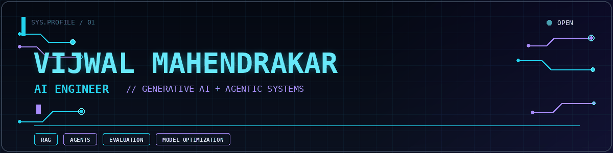
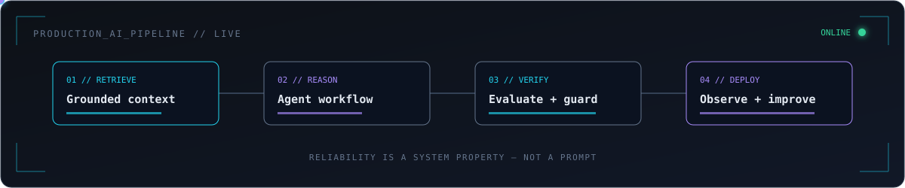
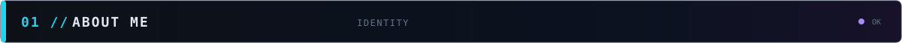
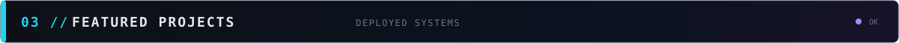
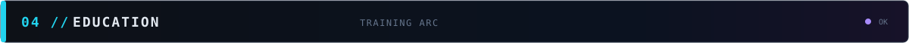
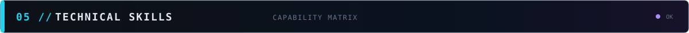
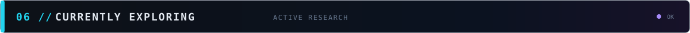
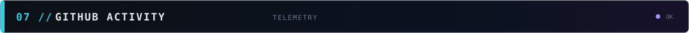

  

  
  
  
  
  

  
  
  

  

<table align="center">
  <tr>
    <td><b>BASE</b> <code>Boston, MA</code></td>
    <td><b>FOCUS</b> <code>GenAI · Agents · RAG</code></td>
    <td><b>STATUS</b> <code>Spring 2027 Co-op</code></td>
    <td><b>MISSION</b> <code>Reliable Production AI</code></td>
  </tr>
</table>

I am an M.S. Artificial Intelligence student at **Northeastern University** focused on building reliable systems around powerful but unpredictable models. My work spans **Generative AI, agentic systems, RAG, LLM evaluation, optimization, and computer vision**—from retrieval and orchestration to verification, deployment, and observability.

> **Currently seeking:** Spring 2027 co-ops beginning January 2027, AI/ML internships, and full-time AI engineering roles.

<b><code>ROLE_01</code> AI Engineer Intern — Kideon</b> · U.S.-based · Remote · Dec 2024–Aug 2025

- Built a production-grade RAG pipeline for health records, smartwatch data, and laboratory results, supporting grounded workout and nutrition planning.
- Developed LLM-based document triage and persistent patient memory using vector retrieval and structured metadata.
- Added source-level traceability and an LLM-as-judge verification layer that routed unsafe, contradictory, or low-confidence recommendations to human review.
- Built containerized FastAPI microservices with Redis-backed retrieval caching; the team subsequently deployed the platform on AWS.

`RAG` `FastAPI` `Docker` `Redis` `AWS` `LLM Evaluation`

<b><code>ROLE_02</code> Video Analytics Intern — Jio Platforms</b> · Hyderabad · Hybrid · Nov 2023–May 2024

- Built a real-time vehicle and license-plate recognition system using YOLOv7 and PaddleOCR, achieving **92%+ accuracy** across varied conditions.
- Reduced inference latency by **35%** with ONNX Runtime and contributed to deployment pipelines for live CCTV and smart-camera prototypes.
- Created Python scraping and annotation tools that added **20,000+ curated samples** and improved robustness to blur and occlusion.
- Fine-tuned Stable Diffusion models to generate synthetic training data for a future baby-monitor product spanning smile, cry, and movement detection.

`Computer Vision` `YOLOv7` `PaddleOCR` `ONNX Runtime` `Stable Diffusion`

<i>Click a system to inspect its architecture, engineering decisions, and results.</i>

<b><code>SYSTEM_01</code> Agentic RAG for Pharmaceutical Safety</b> · Independent · ~15,000 FDA drug labels

Built an end-to-end RAG platform over current FDA-label PDFs and historical DailyMed SPL XML, preserving real document revisions and structured safety information.

- Layout-aware PDF parsing with Docling and pdfplumber; deterministic XML section extraction with lxml/XPath and LOINC codes.
- Hybrid Qdrant + BM25 retrieval, reciprocal-rank fusion, cross-encoder reranking, LangGraph orchestration, guardrails, caching, observability, and evaluation-gated releases.

`Python` `LangGraph` `Qdrant` `BM25` `PostgreSQL` `Redis` `FastAPI` `Docker`

<!-- TODO: Add repository link and final evaluation metrics. -->

<b><code>SYSTEM_02</code> Agentic Game Recommendation System</b> · Independent · Hybrid retrieval + personalization

Built a personalized recommender combining dense search, BM25, RRF, selective HyDE, LLM-assisted tag enrichment, and Steam-library context.

- Created self-distilled training pairs with hard negatives, then fine-tuned a bi-encoder and QLoRA reranker.
- Orchestrated parsing, retrieval, reranking, and explanation through LangGraph with Redis caching, ONNX inference, FastAPI, Docker, and Ollama.

`LangGraph` `ChromaDB` `BM25` `QLoRA` `Redis` `FastAPI` `Ollama` `ONNX`

<!-- TODO: Add repository link and final ranking/latency metrics. -->

<b><code>SYSTEM_03</code> <a href="https://github.com/aatmaj28/Void-AI">VOID AI — Analyst Coverage Gap Intelligence</a></b> · Team of 2 · 1,700+ equities

Co-developed an AI investment-intelligence platform combining SEC-filings RAG, a five-agent CrewAI debate workflow, daily opportunity scoring, and signal validation.

- Owned the backtesting engine, stock-comparison workflow, portfolio UI, authentication integration, historical-score APIs, database migrations, and real-market-data fixes.

`Next.js` `TypeScript` `FastAPI` `CrewAI` `Haystack` `Supabase` `pgvector` `XGBoost`

<b><code>SYSTEM_04</code> <a href="https://github.com/Vijwalmahen/equity-screener">Equity Performance Screener</a></b> · Independent · Walk-forward ML

Built an end-to-end system predicting next-quarter S&amp;P 500 outperformance from time-ordered fundamental and price data.

- XGBoost achieved **0.577 held-out ROC-AUC** and **0.566 expanding-window AUC across 16 quarters**.
- Added SHAP explanations, leakage tests, conformal prediction, transaction-cost analysis, FastAPI, and a React dashboard.

`Python` `XGBoost` `scikit-learn` `SHAP` `FastAPI` `React`

<b><code>TEAM_BUILD</code> <a href="https://github.com/Chandi713/Hackathon---End-Of-The-World">ResilienceAI</a></b> · Hackathon · 8-agent risk simulation

Contributed country selection and full-stack API integration to a LangGraph supply-chain risk platform covering **266 countries** and **25 years** of multi-domain data.

`LangGraph` `Python` `FastAPI` `Next.js` `TypeScript` `Recharts`

| Institution | Program | Timeline | Result |
| --- | --- | --- | --- |
| **Northeastern University**, Boston | M.S. Artificial Intelligence | Sep 2025–Expected 2027 | **3.84/4.00** |
| **Vellore Institute of Technology**, Vellore | B.Tech CSE, specialization in IoT | 2021–2025 | **8.78/10** |

<b>Additional academic signal</b>

- Major project: LLM quantization and model-size reduction research.
- Community: VIT Gamers Club.

| System layer | Technologies |
| --- | --- |
| **Languages** | Python · C++ · SQL · JavaScript · Java · HTML/CSS |
| **Generative AI & Agents** | LLMs · RAG · LangChain · LangGraph · Hugging Face · evaluation · optimization |
| **Machine Learning** | PyTorch · TensorFlow · Keras · scikit-learn · XGBoost · NLP · reinforcement learning |
| **Computer Vision** | OpenCV · YOLO · PaddleOCR · ONNX Runtime |
| **Data & Retrieval** | PostgreSQL · Supabase · pgvector · Qdrant · Redis · Pandas · NumPy |
| **Backend & Cloud** | FastAPI · REST API design · Docker · AWS · Git · Linux |

  
  
  

  
  

<code>SYS.STATUS // BUILDING RELIABLE, PRODUCTION-READY AI</code>

The standard GitHub contribution graph appears below this profile README.

