  

  
  
  

  <code>Boston, MA</code> &nbsp;&bull;&nbsp;
  <code>M.S. Artificial Intelligence @ Northeastern</code> &nbsp;&bull;&nbsp;
  <code>Open to Spring 2027 co-ops</code>

## About Me

I am an M.S. Artificial Intelligence student at Northeastern University focused on **Generative AI, agentic systems, RAG, and LLM evaluation**. I enjoy transforming powerful but unpredictable models into reliable, production-ready systems by designing robust retrieval pipelines, agent workflows, evaluation loops, and safety gates.

My goal is to build AI products that are **accurate, observable, scalable, and genuinely useful** in real-world environments. I am exploring Spring 2027 co-ops beginning in January 2027, AI/ML internships, and full-time AI engineering roles.

## Experience

### AI Engineer Intern — Kideon *(U.S.-based)*

`Remote` &nbsp; `Dec 2024 – Aug 2025`

- Built a production-grade RAG pipeline for health records, smartwatch data, and laboratory results, supporting grounded workout and nutrition planning.
- Developed LLM-based document triage and persistent patient memory using vector retrieval and structured metadata.
- Added source-level traceability and an LLM-as-judge verification layer that routed unsafe, contradictory, or low-confidence recommendations to human review.
- Built containerized FastAPI microservices with Redis-backed retrieval caching; the team subsequently deployed the platform on AWS.

### Video Analytics Intern — Jio Platforms

`Hyderabad, India` &nbsp; `Hybrid` &nbsp; `Nov 2023 – May 2024`

- Developed a real-time vehicle and license-plate recognition system using YOLOv7 and PaddleOCR, achieving **92%+ accuracy** across varied lighting and camera conditions.
- Reduced inference latency by **35%** using ONNX Runtime and contributed to deployment pipelines for live CCTV and prototype smart-camera systems.
- Built Python-based image-scraping and annotation tools that added **20,000+ curated samples**, improving robustness to motion blur, occlusion, and other edge cases.
- Fine-tuned Stable Diffusion models to generate synthetic training data for an internal baby-monitor prototype that evolved from smile detection to cry and movement detection for a planned customer product.

## Featured Projects

### Production-Grade Agentic RAG for Pharmaceutical Safety — *Independent*

Built an end-to-end RAG system over approximately **15,000 FDA drug labels**, using current-version PDFs and historical DailyMed SPL XML to preserve genuine document revisions. Implemented layout-aware parsing with Docling and pdfplumber, section extraction with lxml/XPath and LOINC codes, hybrid Qdrant + BM25 retrieval with RRF, cross-encoder reranking, LangGraph control flow, model routing, guardrails, caching, observability, and evaluation-gated releases.

`Python` `LangGraph` `Qdrant` `BM25` `PostgreSQL` `Redis` `FastAPI` `Docker`

<!-- TODO: Add the pharmaceutical RAG repository link and final evaluation metrics. -->

### Agentic Game Recommendation System — *Independent*

Built a personalized recommendation platform combining ChromaDB dense search, BM25, RRF, selective HyDE, and LLM-assisted tag enrichment. Created self-distilled training pairs with hard negatives, fine-tuned a bi-encoder and QLoRA reranker, and orchestrated query parsing, retrieval, reranking, and explanation through LangGraph. Added Steam-library personalization, two-level Redis caching, ONNX-optimized inference, FastAPI services, and Dockerized local deployment.

`Python` `LangGraph` `ChromaDB` `BM25` `QLoRA` `Redis` `FastAPI` `Ollama` `ONNX`

<!-- TODO: Add the game recommender repository link and final ranking/latency metrics. -->

### [VOID AI — Analyst Coverage Gap Intelligence](https://github.com/aatmaj28/Void-AI) — *Team of 2*

Co-developed an AI investment-intelligence platform that scans **1,700+ U.S. equities** for high market activity and limited analyst coverage. The platform combines SEC-filings RAG, a five-agent CrewAI debate workflow, daily opportunity scoring, and signal validation. Owned major product components including the backtesting engine, stock-comparison workflow, portfolio tracking, authentication integration, historical-score APIs, database migrations, and real-market-data fixes.

`Next.js` `TypeScript` `FastAPI` `CrewAI` `Haystack` `Supabase` `pgvector` `XGBoost`

### [Equity Performance Screener](https://github.com/Vijwalmahen/equity-screener) — *Independent*

Built an end-to-end ML system that predicts next-quarter S&P 500 outperformance from time-ordered fundamental and price data. Benchmarked six classifiers against four financial baselines; XGBoost achieved a **0.577 held-out ROC-AUC**, while expanding-window validation averaged **0.566 AUC across 16 quarters**. Added SHAP explanations, leakage tests, conformal prediction, transaction-cost analysis, a FastAPI backend, and a React dashboard.

`Python` `XGBoost` `scikit-learn` `SHAP` `FastAPI` `React`

### Additional Project

**[ResilienceAI](https://github.com/Chandi713/Hackathon---End-Of-The-World)** — Contributed country-selection and full-stack API integration to a hackathon-built, LangGraph-based supply-chain risk platform covering 266 countries and 25 years of multi-domain data. The system coordinates eight specialist agents and supports interactive risk exploration and cascade simulation.

`LangGraph` `Python` `FastAPI` `Next.js` `TypeScript` `Recharts`

## Education

### Northeastern University — Boston, MA

**Master of Science in Artificial Intelligence** &nbsp;|&nbsp; `Sep 2025 – Expected 2027` 
GPA: **3.84/4.00**

### Vellore Institute of Technology — Vellore, India

**B.Tech in Computer Science and Engineering, specializing in Internet of Things** &nbsp;|&nbsp; `2021 – 2025` 
CGPA: **8.78/10** · Major project focused on LLM quantization and model-size reduction · VIT Gamers Club

## Technical Skills

| Area | Technologies |
| --- | --- |
| **Languages** | Python, C++, SQL, JavaScript, Java, HTML/CSS |
| **Generative AI & Agents** | LLMs, agentic systems, RAG, LangChain, LangGraph, Hugging Face, LLM evaluation and optimization |
| **Machine Learning** | PyTorch, TensorFlow, Keras, scikit-learn, XGBoost, NLP, reinforcement learning |
| **Computer Vision** | OpenCV, YOLO, PaddleOCR, ONNX Runtime |
| **Data & Retrieval** | PostgreSQL, Supabase, pgvector, Qdrant, Redis, Pandas, NumPy |
| **Backend & Cloud** | FastAPI, REST API design, Docker, AWS, Git, Linux |

## Currently Exploring

- Reliable multi-agent systems with routing, memory, guardrails, and human-in-the-loop workflows
- RAG evaluation and optimization across retrieval quality, grounding, latency, and cost
- Efficient LLM deployment through quantization, pruning, and inference optimization

## GitHub Activity

  
  

  

  Building reliable, production-ready AI agents and retrieval systems.

